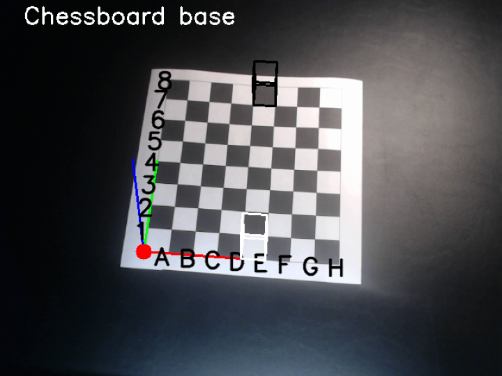
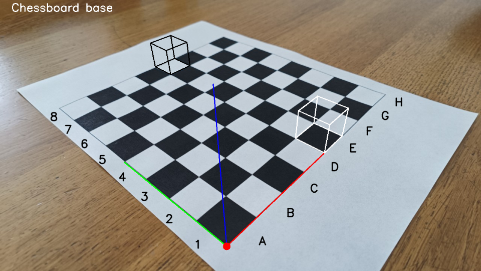

# Checkmate

**Checkmate** provides a complete pipeline for camera calibration using a chessboard pattern, with interactive frame selection from camera or image sequences, robust pose estimation, and 3D visualization overlays (axes, cubes, and chessboard labels) on the detected chessboard.

## Screenshots

<table>
  <tr>
    <th>Camera capture</th>
    <th>Still image frame</th>
  </tr>
  <tr>
    <td></td>
    <td></td>
  </tr>
</table>

## Features

- Enumerate and select camera devices or load sequence of still images from disk.
- Detect chessboard corners and robustly determine board orientation.
- Automatically reject blurred or invalid frames.
- Collect multiple calibration samples and run camera calibration.
- Use estimated pose to draw 3D axes, cubes, and chessboard labels on the image.
- Save calibration results and annotated images with timestamped filenames.

## Algorithm

1. **Source selection:** User selects a camera device or to load chessboard image stills (supplied with project).
2. **Frame acquisition:** Frames of a chessboard are captured from the selected source.
3. **Blur detection:** Frames are checked for sharpness using Laplacian variance.
4. **Chessboard detection:** Chessboard corners are detected and refined.
5. **Corner reordering:** The correct chessboard orientation is determined by analyzing the brightness of the outer squares, ensuring square *A1* is at the correct position.
6. **Pose estimation:** For each candidate orientation, the pose is estimated using *perspective-n-point*, and the best pose is selected based on reprojection error and geometric validity.
7. **Calibration:** After collecting enough valid samples, OpenCV's camera calibration is performed.
8. **Visualization:** The final result overlays 3D axes, cubes, and chessboard labels using the computed camera parameters.

## Implementation

- **`Main`:** Handle startup, user interaction, and frame processing.
- **`FrameLoader`:** Frame acquisition from camera or image sequences.
- **`Chessboard`:** Chessboard detection, corner reordering, and object point generation.
- **`Calibrator`:** Collect calibration samples, run calibration, and save calibration results.
- **`Renderer`:** Project and draw 3D overlays onto the image.
- **`Utils`:** Utility functions for blur detection, device enumeration, and window management.

## License

This project is licensed under the MIT License. See [LICENSE](LICENSE) for details.
